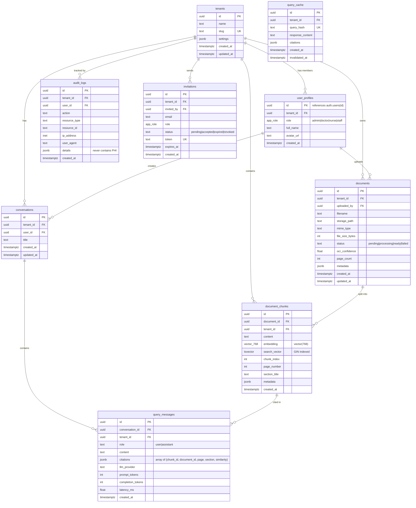

# MedRAG Assistant — Full Build Plan

## Overview

A production-grade, multi-tenant SaaS application where healthcare organizations upload medical documents (PDFs, scanned images) and query them using natural language via RAG. Returns citation-backed answers grounded in uploaded documents. Features multi-provider LLM abstraction, RBAC with tenant isolation, real-time WebSocket processing updates, and a polished marketing landing page + full application.

**Key architectural decisions carried forward from brainstorm:**
- Zero-cost stack (all free tiers)
- Framework-free RAG (no LangChain/LlamaIndex) for full control and debuggability
- Multi-provider LLM with circuit breaker failover
- Hybrid search (BM25 + pgvector + RRF) for superior medical retrieval
- Supabase Auth (replaces custom JWT — resolves auth gaps from SpecFlow analysis)
- Single-org membership model (simplicity over flexibility)

## Problem Statement

Freelance developers competing on Upwork in 2026 need portfolio projects that demonstrate production-grade AI engineering. RAG is the #1 in-demand AI skill, and Health Tech is the highest-growth vertical (Medical VAs up 44%). Most portfolio RAG projects are tutorial-level demos. This project must signal senior-level engineering to clinic CTOs, startup founders, and enterprise teams.

## Proposed Solution

Build MedRAG Assistant as a complete SaaS product with:
1. Marketing landing page (portfolio piece itself)
2. Multi-tenant application with RBAC (Admin/Doctor/Nurse/Staff)
3. Document upload with OCR and real-time WebSocket status
4. RAG query interface with citation-backed, grounded answers
5. Admin panel with audit logs and user management
6. Pre-loaded MTSamples demo data for instant client tryout

## Technical Approach

### Architecture

```
┌──────────────────────────────────────────────────────────────┐
│                     VERCEL (Free Tier)                        │
│  ┌────────────────────────────────────────────────────────┐  │
│  │              React + Vite + TypeScript SPA              │  │
│  │  Landing Page │ Dashboard │ Query UI │ Admin Panel      │  │
│  └────────────────────────┬───────────────────────────────┘  │
└───────────────────────────┼──────────────────────────────────┘
                            │ HTTPS + JWT
┌───────────────────────────┼──────────────────────────────────┐
│                     RENDER (Free Tier)                        │
│  ┌────────────────────────┴───────────────────────────────┐  │
│  │                   FastAPI Application                   │  │
│  │                                                         │  │
│  │  Middleware: CORS → Correlation ID → Logging → Auth     │  │
│  │                                                         │  │
│  │  ┌─────────────┐  ┌──────────────┐  ┌──────────────┐  │  │
│  │  │  Document    │  │  RAG Query   │  │  Admin &     │  │  │
│  │  │  Processing  │  │  Pipeline    │  │  Audit APIs  │  │  │
│  │  │  Pipeline    │  │              │  │              │  │  │
│  │  └──────┬──────┘  └──────┬───────┘  └──────────────┘  │  │
│  │         │                │                              │  │
│  │  ┌──────┴────────────────┴──────┐  ┌──────────────┐   │  │
│  │  │     LLM Provider Router      │  │  WebSocket   │   │  │
│  │  │  Gemini→Groq→HF→Claude      │  │  Manager     │   │  │
│  │  └──────────────────────────────┘  └──────────────┘   │  │
│  └────────────────────────────────────────────────────────┘  │
└───────────────────────────┼──────────────────────────────────┘
                            │
┌───────────────────────────┼──────────────────────────────────┐
│                   SUPABASE (Free Tier)                        │
│  ┌─────────────────┐  ┌─────────────┐  ┌────────────────┐  │
│  │  PostgreSQL +   │  │  Supabase   │  │  Supabase     │  │
│  │  pgvector +     │  │  Auth       │  │  Storage      │  │
│  │  tsvector + RLS │  │  (JWT+RBAC) │  │  (Documents)  │  │
│  └─────────────────┘  └─────────────┘  └────────────────┘  │
└──────────────────────────────────────────────────────────────┘
```

### Resolved Critical Questions (from SpecFlow Analysis)

| # | Question | Resolution | Rationale |
|---|----------|-----------|-----------|
| Q1 | Auth mechanism | **Supabase Auth** (not custom JWT) | Free, handles email verification, password reset, OAuth, session management. Eliminates 4 auth gaps. |
| Q2 | Multi-org membership | **Single-org** per user | Simplifies data model. Invitation to existing user in another org is rejected. |
| Q3 | Nurse "assigned documents" | **Removed**. Nurses see all org documents, can upload + query. Cannot delete. | "Assigned documents" adds complex M:M model with no portfolio ROI. Simplified to permission-based. |
| Q4 | Embedding computation | **HuggingFace Inference API** (primary) + local all-MiniLM-L6-v2 (dev fallback) | Render 512MB RAM too tight for pubmedbert (80MB) + FastAPI + Tesseract simultaneously. HF API is free and offloads compute. |
| Q5 | Demo access model | **Shared read-only demo tenant** with time-limited JWT (1hr). No sign-up required. Upload disabled. | Simplest implementation, no ephemeral tenant cleanup, rate-limited to prevent abuse. |
| Q6 | Render cold start | Frontend health check → **"Server waking up (~30s)"** UI with progress animation | Critical first impression. Health check polling every 2s with animated feedback. |
| Q7 | Query interface | **Conversational** — last 3 exchanges as LLM context | More impressive for portfolio. Manageable prompt engineering. |
| Q8 | Query scoping | **Optional document/specialty filter** in query UI, default "all documents" | Prevents retrieval quality degradation as corpus grows. |
| Q9 | File size limit | **10MB** per file. Upload to Supabase Storage (async), processing via background task. | Avoids Render 30s request timeout. Upload is fast, processing is async. |
| Q10 | Cache invalidation | Cache key: `(org_id, query_hash)`. **Invalidate on any document change** in org. | Prevents stale answers after new uploads — critical for medical context. |
| Q11 | OCR quality | **Tesseract confidence score per page**. Documents <60% avg confidence get warning badge. | Users must know when OCR quality is poor. Builds trust. |
| Q12 | JWT lifecycle | **Supabase Auth handles it** — configurable access token expiry, refresh tokens, revocation. | No custom implementation needed. |

### Updated Role Permissions (Simplified)

| Permission | Admin | Doctor | Nurse | Staff |
|------------|-------|--------|-------|-------|
| documents.upload | Yes | Yes | Yes | No |
| documents.delete | Yes | Yes (own) | Yes (own) | No |
| documents.view | Yes (all) | Yes (all) | Yes (all) | Yes (all) |
| queries.execute | Yes | Yes | Yes | Yes |
| audit.view | Yes | No | No | No |
| users.manage | Yes | No | No | No |
| org.settings | Yes | No | No | No |
| llm.configure | Yes | No | No | No |

### Database Schema (ERD)



### RAG Pipeline (Detailed)

```
Document Upload Flow:
─────────────────────
POST /api/v1/documents/upload
  │
  ├─ 1. Validate file (type via magic bytes, size ≤ 10MB)
  ├─ 2. Upload to Supabase Storage: /{tenant_id}/{uuid}/{filename}
  ├─ 3. Insert document record (status: "processing")
  ├─ 4. Return document_id immediately (202 Accepted)
  └─ 5. Spawn background task: process_document()
         │
         ├─ WS: {"status": "extracting_text"}
         ├─ Extract text: PyMuPDF → check text density per page
         │   └─ If < 50 chars/page → OCR via Tesseract
         │       ├─ Render page at 300 DPI
         │       ├─ OpenCV preprocessing (grayscale, Otsu threshold, denoise)
         │       ├─ pytesseract with --oem 3 --psm 6
         │       └─ Calculate confidence score per page
         │
         ├─ WS: {"status": "chunking"}
         ├─ Section-aware chunking:
         │   ├─ Parse section headers (IMPRESSION, ASSESSMENT, PLAN, etc.)
         │   ├─ Recursive character split within sections (512 tokens, 50 overlap)
         │   ├─ Prepend micro-header: [Doc: filename | Section: X | Page: N]
         │   └─ Generate tsvector for each chunk (BM25 search)
         │
         ├─ WS: {"status": "embedding"}
         ├─ Embed chunks via HuggingFace Inference API:
         │   ├─ Model: NeuML/pubmedbert-base-embeddings (768d)
         │   ├─ Batch size: 32 chunks per API call
         │   └─ Fallback: local all-MiniLM-L6-v2 if HF API is down
         │
         ├─ WS: {"status": "indexing"}
         ├─ Bulk INSERT into document_chunks (content, embedding, search_vector, metadata)
         │
         ├─ Update document status → "ready", set ocr_confidence, page_count
         ├─ Invalidate query_cache for this tenant
         ├─ Audit log: "document.processed"
         └─ WS: {"status": "complete"}

Query Flow:
───────────
POST /api/v1/query
  │
  ├─ 1. Check query_cache (org_id + query_hash)
  │     └─ Cache hit & not invalidated → return cached response
  │
  ├─ 2. Embed query via HuggingFace API (same model as indexing)
  │
  ├─ 3. Hybrid Retrieval (BM25 + Vector + RRF):
  │     ├─ Vector search: SELECT ... ORDER BY embedding <=> query_emb LIMIT 30
  │     │   WHERE tenant_id = $1 [AND document_id IN (...) optional filter]
  │     ├─ BM25 search: SELECT ... WHERE search_vector @@ plainto_tsquery($2) LIMIT 30
  │     │   WHERE tenant_id = $1 [AND document_id IN (...) optional filter]
  │     └─ RRF fusion: score = Σ(1 / (60 + rank_i)), re-rank, take top 5
  │
  ├─ 4. Quality gate: if top chunk similarity < 0.65 → "Insufficient information"
  │
  ├─ 5. Build LLM prompt:
  │     ├─ System: "Answer ONLY from provided context. Cite sources as [Source N]."
  │     ├─ Context: Top-5 chunks with [Source N: filename, Page X, Section Y] headers
  │     ├─ Conversation history: last 3 exchanges (if conversational)
  │     └─ User query
  │
  ├─ 6. Route to LLM provider (Gemini → Groq → HF → Claude):
  │     ├─ Circuit breaker: 3 failures → 60s cooldown
  │     ├─ Rate limit awareness: proactive switch before hitting limit
  │     └─ Structured output: {answer, cited_claims[], sources[], has_unsupported_claims}
  │
  ├─ 7. Post-generation verification:
  │     └─ Check every [Source N] reference maps to a retrieved chunk
  │
  ├─ 8. Store in query_messages + cache response
  ├─ 9. Audit log: "query.executed"
  └─ 10. Return response with citations
```

### Implementation Phases

#### Phase 1: Foundation (Project Setup, Auth, Database)

**Tasks & Deliverables:**

- [x] Initialize monorepo structure:
  ```
  medrag-assistant/
  ├── backend/
  │   ├── app/
  │   │   ├── api/v1/          # Route handlers
  │   │   ├── core/            # Config, security, logging
  │   │   ├── models/          # SQLAlchemy models
  │   │   ├── schemas/         # Pydantic schemas
  │   │   ├── services/        # Business logic
  │   │   ├── providers/       # LLM provider implementations
  │   │   └── middleware/      # Custom middleware
  │   ├── migrations/          # Alembic
  │   ├── tests/
  │   ├── requirements.txt
  │   ├── Dockerfile
  │   └── main.py
  ├── frontend/
  │   ├── src/
  │   │   ├── components/      # Reusable UI components
  │   │   ├── pages/           # Route pages
  │   │   ├── hooks/           # Custom React hooks
  │   │   ├── services/        # API client
  │   │   ├── stores/          # State management
  │   │   └── types/           # TypeScript types
  │   ├── package.json
  │   ├── vite.config.ts
  │   ├── vercel.json
  │   └── tailwind.config.ts
  ├── docs/
  │   ├── brainstorms/
  │   └── plans/
  ├── scripts/                 # Seed data, utilities
  └── README.md
  ```

- [x] **`backend/app/core/config.py`** — Pydantic Settings with all env vars:
  - `SUPABASE_URL`, `SUPABASE_ANON_KEY`, `SUPABASE_SERVICE_KEY`
  - `DATABASE_URL` (direct connection for migrations)
  - `DATABASE_POOL_URL` (pooler connection for app)
  - `GEMINI_API_KEY`, `GROQ_API_KEY`, `HF_API_TOKEN`, `ANTHROPIC_API_KEY` (optional)
  - `CORS_ORIGINS`, `APP_VERSION`, `ENVIRONMENT`

- [x] **`backend/app/core/database.py`** — Async SQLAlchemy engine + session factory with tenant context setting

- [x] **`backend/app/models/`** — SQLAlchemy models for all tables in ERD:
  - `tenant.py` — Tenant model
  - `user_profile.py` — UserProfile with role enum
  - `document.py` — Document model with status enum
  - `document_chunk.py` — DocumentChunk with pgvector column
  - `conversation.py` — Conversation model
  - `query_message.py` — QueryMessage with citations JSON
  - `query_cache.py` — QueryCache model
  - `audit_log.py` — AuditLog (append-only)
  - `invitation.py` — Invitation with status enum

- [x] **`backend/migrations/`** — Alembic setup with initial migration:
  - Enable pgvector extension
  - Enable pg_trgm extension (for fuzzy text search)
  - Create all tables with RLS policies
  - Create HNSW index on embeddings
  - Create GIN index on tsvector
  - Create indexes on tenant_id (every table)
  - Seed role_permissions data

- [x] **`backend/app/core/auth.py`** — Supabase Auth integration:
  - JWT verification dependency (decode Supabase JWT, extract user_id + tenant_id + role from custom claims)
  - `require_permission(permission: str)` dependency factory
  - Supabase Auth client for sign-up, sign-in, password reset, email verification

- [x] **`backend/app/api/v1/auth.py`** — Auth endpoints:
  - `POST /auth/signup` — Create user + create/join org
  - `POST /auth/signin` — Sign in via Supabase Auth
  - `POST /auth/signout` — Revoke session
  - `POST /auth/forgot-password` — Trigger password reset email
  - `POST /auth/reset-password` — Complete password reset
  - `GET /auth/me` — Current user profile + org + role

- [x] **`backend/app/api/v1/tenants.py`** — Org management:
  - `POST /tenants` — Create organization (creator becomes Admin)
  - `GET /tenants/me` — Current org details
  - `PATCH /tenants/me` — Update org settings (Admin only)

- [x] **`backend/app/api/v1/invitations.py`** — User invitation flow:
  - `POST /invitations` — Admin invites user by email + role
  - `GET /invitations/{token}` — Validate invitation link
  - `POST /invitations/{token}/accept` — Accept invitation (sign up + join org)
  - `DELETE /invitations/{id}` — Revoke invitation (Admin only)

- [x] **`backend/main.py`** — FastAPI app with middleware stack, exception handlers, health checks

- [x] **`frontend/`** — Vite + React + TypeScript scaffold with:
  - TailwindCSS configuration
  - React Router v7 setup
  - API client service (axios with JWT interceptor + refresh logic)
  - Supabase Auth client (for frontend auth flows)
  - `vercel.json` with SPA rewrite rules

**Success Criteria:**
- User can sign up, create org, sign in, sign out, reset password
- Admin can invite users by email with role assignment
- Invited user can accept and join org
- All API endpoints enforce tenant isolation via RLS
- JWT auth works end-to-end (frontend → backend → Supabase)
- Alembic migrations apply cleanly to Supabase

---

#### Phase 2: Core Backend (Document Processing + RAG Pipeline)

**Tasks & Deliverables:**

- [x] **`backend/app/services/document_processor.py`** — Document processing pipeline:
  - PDF text extraction via PyMuPDF (fitz)
  - Automatic OCR fallback (< 50 chars/page → Tesseract)
  - OpenCV preprocessing (grayscale, Otsu threshold, median blur)
  - OCR confidence scoring per page
  - Section-aware chunking with medical separators
  - Micro-header prepend on each chunk
  - tsvector generation for BM25

- [x] **`backend/app/services/embedding_service.py`** — Embedding abstraction:
  - Primary: HuggingFace Inference API (`NeuML/pubmedbert-base-embeddings`, 768d)
  - Fallback: local `all-MiniLM-L6-v2` (for dev or API outage)
  - Batch embedding (32 chunks per call)
  - L2 normalization before storage

- [x] **`backend/app/services/chunking_service.py`** — Section-aware chunker:
  - Parse medical section headers (IMPRESSION, ASSESSMENT, PLAN, HPI, MEDICATIONS, etc.)
  - Recursive character split within sections (512 tokens, 50 token overlap)
  - Handle short documents (< 512 tokens → single chunk)
  - Generate chunk metadata (page_number, section_title, chunk_index)

- [x] **`backend/app/services/rag_service.py`** — RAG query pipeline:
  - Hybrid retrieval: pgvector cosine similarity + tsvector BM25 + RRF fusion
  - Quality gate (similarity threshold 0.65)
  - Conversation context (last 3 exchanges)
  - Prompt construction with citation instructions
  - Post-generation citation verification
  - Response caching with tenant-scoped invalidation

- [x] **`backend/app/providers/`** — LLM provider implementations:
  - `base.py` — Abstract `LLMProvider` with `complete()`, `stream()`, `health_check()`
  - `gemini.py` — Google Gemini (google-generativeai SDK)
  - `groq.py` — Groq (OpenAI-compatible SDK)
  - `huggingface.py` — HuggingFace Inference API
  - `claude.py` — Anthropic Claude (anthropic SDK)
  - `router.py` — Provider router with:
    - Priority chain: Gemini → Groq → HF → Claude
    - Circuit breaker (3 failures → 60s cooldown)
    - Rate limit tracking (proactive switch before limit)
    - Retry with exponential backoff (1s, 2s, 4s + jitter)
    - Request/response logging with token counts

- [x] **`backend/app/services/websocket_manager.py`** — WebSocket connection manager:
  - Tenant-scoped connections (user can only receive events for their org)
  - JWT authentication on WebSocket handshake (via query param)
  - Processing status events: `{type, document_id, status, progress, timestamp}`
  - Ping/pong heartbeat every 30s
  - Graceful reconnection handling

- [x] **`backend/app/api/v1/documents.py`** — Document endpoints:
  - `POST /documents/upload` — Upload file (validate → store → spawn background task → return 202)
  - `GET /documents` — List org documents (with status, pagination, search)
  - `GET /documents/{id}` — Document details + chunk count + OCR confidence
  - `DELETE /documents/{id}` — Delete document + chunks + invalidate cache (Admin/owner)
  - `GET /documents/{id}/preview` — Signed URL for document preview

- [x] **`backend/app/api/v1/queries.py`** — Query endpoints:
  - `POST /queries` — Execute RAG query (with optional document filter)
  - `GET /conversations` — List user's conversations
  - `GET /conversations/{id}/messages` — Conversation history with citations
  - `DELETE /conversations/{id}` — Delete conversation

- [x] **`backend/app/api/v1/ws.py`** — WebSocket endpoint:
  - `WS /ws/processing` — Real-time document processing updates

**Success Criteria:**
- Upload a PDF → see real-time processing status via WebSocket → document becomes queryable
- Upload a scanned image → OCR extracts text → embedded and searchable
- Ask a question → get citation-backed answer with [Source N] references
- Citations link to correct document, page, and section
- LLM failover works (block primary → falls back to secondary)
- "Insufficient information" response when query has no relevant chunks
- Conversational follow-ups work within a session

---

#### Phase 3: Frontend (Landing Page + Application UI)

**All frontend work MUST use the `/frontend-design` skill for distinctive, production-grade UI.**

**Tasks & Deliverables:**

- [x] **Landing Page** (`frontend/src/pages/Landing.tsx`):
  - Hero section with product tagline + demo CTA
  - Feature highlights (RAG, multi-tenant, citation-backed, real-time)
  - Tech stack showcase (for developer credibility)
  - Live demo button (no sign-up required)
  - Sign-up / Sign-in CTA
  - Mobile responsive
  - Distinctive design — NOT generic AI gradient aesthetics

- [x] **Auth Pages**:
  - `SignIn.tsx` — Email + password, OAuth buttons (Google), forgot password link
  - `SignUp.tsx` — Create account + create org (or accept invitation)
  - `ForgotPassword.tsx` — Password reset request
  - `ResetPassword.tsx` — Set new password
  - `AcceptInvitation.tsx` — Accept org invitation + sign up if needed

- [x] **Dashboard** (`frontend/src/pages/Dashboard.tsx`):
  - Document list with status badges (processing/ready/failed)
  - OCR confidence indicators
  - Upload button with drag-and-drop zone
  - Upload progress + real-time WebSocket status
  - Document count / storage usage stats
  - Empty state with upload prompt (first-time user)
  - Search/filter documents

- [x] **Query Interface** (`frontend/src/pages/QueryChat.tsx`):
  - Chat-like conversational UI
  - Optional document filter panel (select specific docs or specialties)
  - Message bubbles with citation chips
  - Citation panel: click [Source N] → shows document name, page, section, highlighted passage
  - "Thinking..." state with LLM provider indicator
  - "Insufficient information" state with suggestions
  - New conversation button

- [x] **Document Viewer** (`frontend/src/pages/DocumentViewer.tsx`):
  - PDF.js viewer for PDFs
  - Image viewer for scanned documents
  - Highlighted citation passages (linked from query results)
  - Document metadata sidebar (upload date, uploader, OCR confidence, chunk count)

- [x] **Admin Panel** (`frontend/src/pages/Admin/`):
  - `Users.tsx` — User list, invite user, change role, remove user
  - `AuditLog.tsx` — Filterable audit log (by user, action, date range)
  - `Settings.tsx` — Org settings, LLM provider configuration (API key input for Claude)
  - `LLMUsage.tsx` — Provider usage stats (token counts, costs, failover events)

- [x] **Shared Components**:
  - `ColdStartGuard.tsx` — Health check polling + "Server waking up (~30s)" overlay with animation
  - `RoleGate.tsx` — Conditional rendering by user role
  - `WebSocketProvider.tsx` — React context for WebSocket connection + auto-reconnect
  - `ErrorBoundary.tsx` — Graceful error states (no blank screens)
  - `LoadingStates.tsx` — Skeleton loaders for all data-fetching views

- [x] **State Management**:
  - `useAuth` hook — Supabase Auth state + user profile + role
  - `useDocuments` hook — TanStack Query for document CRUD
  - `useConversation` hook — TanStack Query for conversations + messages
  - `useWebSocket` hook — WebSocket connection lifecycle + event handling
  - `useHealthCheck` hook — Backend health polling for cold start detection

**Success Criteria:**
- Landing page is visually distinctive and portfolio-worthy
- Complete auth flow works (sign up → verify email → sign in → dashboard)
- Document upload shows real-time processing via WebSocket
- Query interface returns cited answers with clickable source references
- Admin panel manages users, views audit logs, configures LLM provider
- Cold start overlay appears when backend is spinning up
- All pages are responsive (mobile-friendly)
- No blank screens, no hanging spinners, no raw error messages

---

#### Phase 4: Demo Data + Integration

**Tasks & Deliverables:**

- [x] **`scripts/seed_demo_data.py`** — Demo data seeding script:
  - Download MTSamples dataset from Kaggle (CC0 license)
  - Curate 50-100 documents across 6 specialties:
    - Cardiology (~15 docs)
    - Orthopedic (~10 docs)
    - General Medicine (~15 docs)
    - Neurology (~10 docs)
    - Gastroenterology (~10 docs)
    - Radiology (~10 docs)
  - Convert to PDF format (for realistic document handling)
  - Create demo tenant + demo user (read-only role)
  - Process all documents through the full pipeline (extract → chunk → embed → index)
  - Pre-cache 5-10 common demo queries for instant response

- [x] **`backend/app/api/v1/demo.py`** — Demo access endpoints:
  - `POST /demo/session` — Generate time-limited JWT (1hr, read-only, scoped to demo tenant)
  - Rate limit: 20 queries/hour per demo session
  - Upload disabled for demo users

- [x] **`frontend/src/pages/Demo.tsx`** — Demo experience:
  - Auto-login with demo JWT
  - Suggested queries panel ("Try asking...")
  - Banner: "Demo Mode — Sign up for full access"
  - Conversion CTA after 3 queries

- [x] **Cache integration** — Query result caching:
  - In-memory LRU cache (per-tenant, max 100 entries)
  - Cache key: `sha256(tenant_id + query_text)`
  - Invalidation: on document upload/delete within tenant
  - Cached response indicator in UI

- [x] **Supabase keep-alive** — Prevent 7-day inactivity pause:
  - `scripts/keep_alive.py` — Lightweight DB query via GitHub Actions cron (every 5 days)
  - Or: Render cron job that pings Supabase

**Success Criteria:**
- Demo tenant has 50-100 real medical documents pre-loaded
- Visitor clicks "Try Demo" → immediately can query medical documents
- Demo queries return within 2-3 seconds (cached) or 5-8 seconds (uncached)
- Demo session expires after 1 hour
- Supabase project stays active (never pauses)

---

#### Phase 5: Production Hardening

**Tasks & Deliverables:**

- [x] **`backend/app/core/logging.py`** — Structured logging with structlog:
  - JSON output format
  - Correlation ID (X-Request-ID) on every log line
  - Tenant context on every log line
  - Request/response logging middleware (method, path, status, duration)
  - Sensitive field masking (never log file content, query results, or PHI)

- [x] **`backend/app/middleware/`**:
  - `correlation.py` — Generate/propagate X-Request-ID
  - `logging.py` — Request/response logging
  - `rate_limit.py` — In-memory rate limiting (per-tenant, per-endpoint):
    - `/query`: 10/minute
    - `/documents/upload`: 20/hour
    - `/demo/session`: 5/hour per IP
  - `error_handler.py` — Global exception handlers (no stack traces in responses)

- [x] **`backend/app/services/audit_service.py`** — Audit trail:
  - Log every: document.upload, document.view, document.delete, query.execute, user.login, user.invite, role.change, settings.update
  - Append-only (no UPDATE/DELETE on audit_logs table)
  - Include: user_id, tenant_id, action, resource_type, resource_id, ip_address, timestamp
  - Never include PHI in audit details

- [x] **Health check endpoints**:
  - `GET /health/live` — Process alive
  - `GET /health/ready` — DB + Supabase Storage + at least one LLM provider available
  - `GET /health/startup` — Boot complete + version info

- [x] **Input validation** — Pydantic v2 schemas for all endpoints:
  - File upload: magic byte validation, size check, mime type whitelist
  - Query input: max length, sanitize for prompt injection patterns
  - All IDs: UUID format validation
  - Pagination: max page size 100

- [x] **Prompt injection defense**:
  - Input sanitization: strip known injection patterns
  - System prompt isolation: never include user input in system prompt
  - Output filtering: detect and flag responses that leak system prompt content
  - Log suspected injection attempts to audit trail

- [x] **CORS configuration** — Scoped to Vercel deployment URL + localhost for dev

- [x] **API documentation** — FastAPI auto-generated OpenAPI/Swagger at `/docs`

- [x] **Error handling patterns**:
  - Custom `AppException` hierarchy with error codes
  - User-friendly error messages (no stack traces)
  - Request ID in every error response (for debugging)
  - Graceful degradation (LLM down → "Service temporarily unavailable, try again")

- [x] **Frontend accessibility** — WCAG 2.1 AA on key flows:
  - Keyboard navigation
  - Screen reader labels
  - Color contrast compliance
  - Focus management on modals/dialogs

**Success Criteria:**
- All logs are structured JSON with correlation IDs
- Rate limiting prevents abuse (demo and authenticated)
- Audit trail captures every PHI access
- No stack traces leak to client
- Health checks report accurate dependency status
- Prompt injection attempts are detected and logged
- API docs are auto-generated and accurate

---

#### Phase 6: Deployment + CI/CD

**Tasks & Deliverables:**

- [x] **`backend/Dockerfile`** — Production Docker image:
  - Python 3.12 slim base
  - Install system deps: Tesseract, OpenCV libs
  - Install Python deps from requirements.txt
  - Gunicorn + Uvicorn workers (1 worker for free tier)
  - Health check instruction

- [ ] **Render deployment**:
  - Connect GitHub repo → auto-deploy on push to `main`
  - Set environment variables (all secrets)
  - Configure health check path: `/health/live`
  - Free tier web service

- [ ] **Supabase setup**:
  - Create project
  - Enable pgvector extension
  - Run Alembic migrations
  - Configure RLS policies
  - Set up Storage bucket (private, 10MB max, PDF/image mime types)
  - Configure Auth (email verification enabled, password policy)

- [ ] **Vercel deployment**:
  - Connect GitHub repo → auto-deploy frontend on push
  - Set environment variables (VITE_API_URL, VITE_SUPABASE_URL, VITE_SUPABASE_ANON_KEY)
  - Verify SPA rewrite rules work

- [x] **GitHub Actions CI**:
  - `ci.yml` — Run on PR:
    - Backend: `ruff check` + `ruff format --check` + `pytest`
    - Frontend: `eslint` + `tsc --noEmit` + `vitest`
  - `keep-alive.yml` — Cron every 5 days: ping Supabase to prevent pause

- [x] **README.md** — Portfolio-grade documentation:
  - Project overview + live demo link
  - Architecture diagram
  - Tech stack with rationale
  - Screenshots
  - Local development setup
  - Environment variables reference
  - API documentation link
  - HIPAA-awareness notes

**Success Criteria:**
- Push to `main` → auto-deploys backend (Render) + frontend (Vercel)
- Live demo URL works end-to-end
- CI catches lint/type/test failures on PRs
- Supabase stays active via keep-alive cron
- README is impressive enough to serve as portfolio documentation

---

## Alternative Approaches Considered

| Alternative | Decision | Rationale (see brainstorm) |
|------------|----------|---------------------------|
| LangChain/LlamaIndex | Rejected → framework-free | Full control over RAG pipeline, better debuggability for medical accuracy, no hidden defaults |
| Next.js | Rejected → React + Vite | SPA is sufficient (no SSR needed), faster DX, simpler deployment |
| Railway | Rejected → Render | True zero-cost free tier, "production" signal vs Railway's "prototype" association |
| ChromaDB / Qdrant | Rejected → pgvector | Consolidates infrastructure, one fewer service, production-standard |
| Custom JWT auth | Rejected → Supabase Auth | Free, handles email verification, password reset, OAuth, session management out of the box |
| all-MiniLM-L6-v2 | Rejected as primary → pubmedbert | pubmedbert scores 95.62% vs 93.46% on medical benchmarks. MiniLM as dev/fallback only |
| Single search (vector only) | Rejected → hybrid BM25 + vector + RRF | Hybrid reduces hallucination significantly in medical domains |

## System-Wide Impact

### Interaction Graph

```
Document Upload → triggers: processing background task → triggers: WebSocket events → triggers: cache invalidation
User Sign-up → triggers: Supabase Auth webhook → triggers: user_profile creation → triggers: audit log
Query Execution → triggers: embedding API call → triggers: DB query → triggers: LLM API call → triggers: cache write → triggers: audit log
Role Change → triggers: Supabase custom claims update → triggers: audit log (existing sessions retain old role until token refresh)
Document Delete → triggers: chunk deletion → triggers: cache invalidation → triggers: storage file deletion → triggers: audit log
```

### Error Propagation

```
HuggingFace API timeout → fallback to local MiniLM → if OOM → return 503 "Embedding service unavailable"
LLM provider rate limit → circuit breaker opens → next provider in chain → if all down → return 503 "AI service temporarily unavailable"
Supabase DB connection error → health check returns unhealthy → Render marks as unhealthy → restarts container
OCR failure (corrupt image) → document status "failed" → WebSocket error event → user sees "Processing failed" with retry button
File upload too large → 413 response before processing → user sees "File exceeds 10MB limit"
```

### State Lifecycle Risks

| Risk | Mitigation |
|------|-----------|
| Document stuck in "processing" (background task crashes) | 10-minute timeout → auto-mark as "failed" with retry option |
| Orphaned chunks (document deleted mid-processing) | Transaction: delete document + chunks atomically |
| Stale cache after document upload | Cache invalidation on ANY document change in tenant |
| JWT with old role after role change | Supabase Auth refresh token rotation forces new claims on next refresh |
| Demo tenant data corruption | Demo tenant is seeded from script, can be rebuilt anytime |

## Acceptance Criteria

### Functional Requirements

- [ ] Complete auth flow: sign up → email verify → sign in → dashboard
- [ ] Admin can invite users by email with role assignment
- [ ] Upload PDF/image → real-time WebSocket processing → document ready
- [ ] OCR works on scanned documents with confidence scoring
- [ ] RAG query returns citation-backed answers with [Source N] references
- [ ] Citations link to correct document, page, and section
- [ ] Conversational follow-up queries maintain context
- [ ] Optional document filter in query interface
- [ ] "Insufficient information" response when no relevant chunks exist
- [ ] LLM provider failover works transparently
- [ ] Admin panel: manage users, view audit logs, configure LLM provider
- [ ] Demo mode: instant access with pre-loaded medical documents
- [ ] Landing page is polished and portfolio-worthy

### Non-Functional Requirements

- [ ] Zero-cost: all services on free tiers
- [ ] Cold start handled gracefully in UI (~30s Render spin-up)
- [ ] Supabase project never pauses (keep-alive cron)
- [ ] Structured JSON logging with correlation IDs
- [ ] Per-tenant rate limiting on all endpoints
- [ ] HIPAA-aware: audit trail, data isolation, no PHI in logs
- [ ] CORS scoped to deployment domains
- [ ] No stack traces in API error responses
- [ ] Input validation on all endpoints (Pydantic v2)
- [ ] Prompt injection defense on query input

### Quality Gates

- [ ] Backend: ruff lint + format pass
- [ ] Frontend: eslint + TypeScript strict mode pass
- [ ] Backend tests: ≥80% coverage on services/
- [ ] Frontend tests: component tests on critical flows (auth, query, upload)
- [ ] API documentation auto-generated and accurate
- [ ] README with architecture diagram, screenshots, setup instructions
- [ ] Live demo URL functional end-to-end

## Success Metrics

| Metric | Target |
|--------|--------|
| Demo load time (cold start) | < 35s with loading UI |
| Demo load time (warm) | < 2s |
| Query response time (cached) | < 500ms |
| Query response time (uncached) | < 8s |
| Document processing time (10-page PDF) | < 30s |
| OCR accuracy (printed medical docs) | > 90% |
| Lighthouse score (landing page) | > 90 |
| API uptime (excluding cold starts) | > 99% |

## Dependencies & Prerequisites

| Dependency | Type | Free Tier Limit | Risk |
|-----------|------|----------------|------|
| Supabase | Database + Auth + Storage | 500MB DB, 1GB storage, 50K MAUs | 7-day pause (mitigated by keep-alive) |
| Render | Backend hosting | 750 hrs/month, 512MB RAM | Cold start ~30s (mitigated by UI) |
| Vercel | Frontend hosting | 100GB bandwidth | Low risk |
| HuggingFace Inference API | Embeddings | Rate-limited free tier | Fallback to local model |
| Google Gemini | LLM (primary) | 15 RPM, 1M tokens/day | Failover to Groq |
| Groq | LLM (secondary) | 30 RPM | Failover to HF |
| GitHub Actions | CI/CD + keep-alive | 2,000 mins/month | Low risk |

## Free Tier Capacity Budget

| Resource | Budget | Estimated Usage | Headroom |
|----------|--------|----------------|----------|
| Supabase DB (500MB) | 500MB | ~50MB (demo data) + ~10MB (app data) + ~30MB (indexes) | ~410MB |
| Supabase Storage (1GB) | 1GB | ~200MB (demo PDFs) + ~100MB (user uploads) | ~700MB |
| Render RAM (512MB) | 512MB | ~300MB (FastAPI + Tesseract + deps) | ~200MB |
| Gemini (1M tokens/day) | 1M | ~50K tokens/demo session | ~950K |
| HF Inference API | Rate-limited | ~100 embedding calls/day | Adequate |

## Risk Analysis & Mitigation

| Risk | Likelihood | Impact | Mitigation |
|------|-----------|--------|-----------|
| Render 512MB OOM during OCR | Medium | High | Process one page at a time, not entire document. Free memory between pages. |
| Supabase free tier pause | High | Critical | GitHub Actions keep-alive cron every 5 days |
| HuggingFace API rate limit during bulk seeding | Medium | Medium | Seed demo data with delays. Local fallback model. |
| All LLM providers down simultaneously | Low | High | Return cached responses where available. Graceful error message. |
| Demo abuse (excessive queries) | Medium | Medium | 20 queries/hour limit per demo session. 1-hour session expiry. |
| OCR produces garbled text on poor scans | Medium | Medium | Confidence scoring + warning badge. User can view extracted text. |

## Sources & References

### Origin

- **Brainstorm document:** [docs/brainstorms/2026-03-12-medrag-assistant-brainstorm.md](../brainstorms/2026-03-12-medrag-assistant-brainstorm.md)
  - Key decisions carried forward: multi-provider LLM, framework-free RAG, pgvector + Supabase, React + FastAPI split, Render hosting, MTSamples demo data, WebSocket processing status

### Research Sources

#### RAG Pipeline & Medical AI
- [Comparative Evaluation of Advanced Chunking for Clinical Decision Support (PMC)](https://pmc.ncbi.nlm.nih.gov/articles/PMC12649634/)
- [Medical RAG Best Practices (arXiv)](https://arxiv.org/html/2602.03368)
- [Best Chunking Strategies for RAG in 2026](https://www.firecrawl.dev/blog/best-chunking-strategies-rag)
- [Hybrid Search in PostgreSQL - ParadeDB](https://www.paradedb.com/blog/hybrid-search-in-postgresql-the-missing-manual)
- [RAG Hallucination Guardrails (MDPI)](https://www.mdpi.com/2673-2688/6/9/226)
- [RAG Citation-Aware Architecture (Tensorlake)](https://www.tensorlake.ai/blog/rag-citations)

#### Embedding Models
- [NeuML/pubmedbert-base-embeddings](https://huggingface.co/NeuML/pubmedbert-base-embeddings)
- [NeuML/pubmedbert-base-embeddings-matryoshka](https://huggingface.co/NeuML/pubmedbert-base-embeddings-matryoshka)
- [NeuML/bioclinical-modernbert-base-embeddings](https://huggingface.co/NeuML/bioclinical-modernbert-base-embeddings)
- [Embeddings for Medical Literature (NeuML)](https://medium.com/neuml/embeddings-for-medical-literature-74dae6abf5e0)

#### pgvector & Database
- [pgvector 0.8.0 Release](https://www.postgresql.org/about/news/pgvector-080-released-2952/)
- [Supabase HNSW Indexes](https://supabase.com/docs/guides/ai/vector-indexes/hnsw-indexes)
- [Supabase: Fewer Dimensions Are Better](https://supabase.com/blog/fewer-dimensions-are-better-pgvector)
- [AWS Deep Dive: IVFFlat vs HNSW](https://aws.amazon.com/blogs/database/optimize-generative-ai-applications-with-pgvector-indexing-a-deep-dive-into-ivfflat-and-hnsw-techniques/)

#### FastAPI & Backend
- [FastAPI Production Deployment Best Practices (Render)](https://render.com/articles/fastapi-production-deployment-best-practices)
- [Multi-Tenant Design with FastAPI (March 2026)](https://blog.greeden.me/en/2026/03/10/introduction-to-multi-tenant-design-with-fastapi-practical-patterns-for-tenant-isolation-authorization-database-strategy-and-audit-logs/)
- [Production-Grade Logging for FastAPI](https://medium.com/@laxsuryavanshi.dev/production-grade-logging-for-fastapi-applications-a-complete-guide-f384d4b8f43b)
- [SlowAPI Rate Limiting](https://github.com/laurentS/slowapi)

#### Supabase
- [Supabase RLS Documentation](https://supabase.com/docs/guides/database/postgres/row-level-security)
- [Supabase Custom Claims & RBAC](https://supabase.com/docs/guides/database/postgres/custom-claims-and-role-based-access-control-rbac)
- [Supabase Storage Access Control](https://supabase.com/docs/guides/storage/security/access-control)

#### HIPAA & Security
- [HIPAA-Ready Pipeline with FastAPI, PostgreSQL, and Vault](https://www.wellally.tech/blog/build-hipaa-compliant-pipeline-fastapi-vault)
- [HIPAA-Compliant AI Frameworks 2025-2026](https://www.getprosper.ai/blog/hipaa-compliant-ai-frameworks-guide)
- [HIPAA Encryption Requirements 2026](https://www.hipaajournal.com/hipaa-encryption-requirements/)

#### Frontend & Deployment
- [Vite on Vercel](https://vercel.com/docs/frameworks/frontend/vite)
- [React + Vite SPA on Vercel](https://vercel.com/templates/react/vite-react)

#### Demo Data
- [MTSamples Medical Transcriptions (Kaggle)](https://www.kaggle.com/datasets/tboyle10/medicaltranscriptions) — CC0 Public Domain
- [MTSamples.com](https://www.mtsamples.com/) — Original source

#### LLM Providers
- [LiteLLM Documentation](https://docs.litellm.ai/docs/)
- [Building RAG Without LangChain or LlamaIndex](https://blog.futuresmart.ai/building-rag-applications-without-langchain-or-llamaindex)
- [LlamaIndex vs LangChain 2026](https://contabo.com/blog/llamaindex-vs-langchain-which-one-to-choose-in-2026/)
